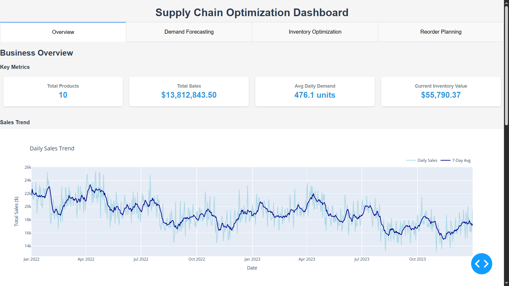

# Supply Chain Optimization for Small Businesses



## Project Overview

This project implements a comprehensive supply chain optimization system for small businesses. It uses historical sales data to forecast demand, optimize inventory levels, and create reorder plans that minimize total inventory costs while preventing stockouts.

### Key Features

- **Data Generation**: Creates synthetic supply chain data that mimics real-world patterns including seasonality and trends
- **Exploratory Data Analysis**: Analyzes historical demand, inventory levels, and supply chain costs
- **Demand Forecasting**: Implements multiple time series models to predict future product demand
- **Inventory Optimization**: Calculates optimal order quantities, reorder points, and safety stock using EOQ and other models
- **Interactive Dashboard**: Visualizes insights and recommendations through an intuitive Dash web application

## Getting Started

### Prerequisites

- Python 3.8+
- Anaconda or Miniconda (recommended for environment management)

### Installation

1. Clone this repository:
   ```
   git clone https://github.com/AkashKK25/SupplyChainOptimization.git
   cd SupplyChainOptimization
   ```

2. Create and activate the environment:
   ```
   conda create -n supply_chain python=3.10
   conda activate supply_chain
   ```

3. Install required packages:
   ```
   pip install -r requirements.txt
   ```

### Running the Project

1. **Generate Data**: Run the data generation notebook
   ```
   jupyter notebook notebooks/01_Data_Generation.ipynb
   ```

2. **Run the Dashboard**:
   ```
   cd dashboard
   python app.py
   ```
   
3. Open your browser and navigate to `http://127.0.0.1:8050/`

## Project Structure

- `data/`: Stores generated CSV files (not included in repository)
- `notebooks/`: Jupyter notebooks for data generation, analysis, and modeling
- `src/`: Source code for reusable functions
- `dashboard/`: Interactive Dash web application
- `docs/`: Project documentation and report

## Methodology

### Data Analysis

The project begins with a comprehensive analysis of historical sales data, inventory levels, and costs. We identify key patterns in demand, including seasonality, trends, and product-specific characteristics.

### Forecasting Models

Implemented four forecasting models and compare their performance:
- Moving Average: A simple baseline model
- Holt-Winters Exponential Smoothing: Captures trend and seasonality
- SARIMA: Statistical time series model with seasonality
- Random Forest with Feature Engineering: Machine learning approach

### Inventory Optimization

Used classic inventory models with a modern twist:
- Economic Order Quantity (EOQ): Optimizes order sizes
- Reorder Point (ROP): Determines when to place orders
- Safety Stock Calculations: Prevents stockouts due to demand variability
- Service Level Analysis: Balances costs vs. customer satisfaction

## Results

The optimization recommendations demonstrate potential cost savings of 15-30% compared to current inventory management practices, while reducing stockout events by over 50%.

## Acknowledgments

- This project was created as a data science portfolio project
- Inspired by real supply chain challenges faced by small businesses

## Author
[Akash Kondaparthi](https://AkashKK25.github.io/Data-Portfolio)